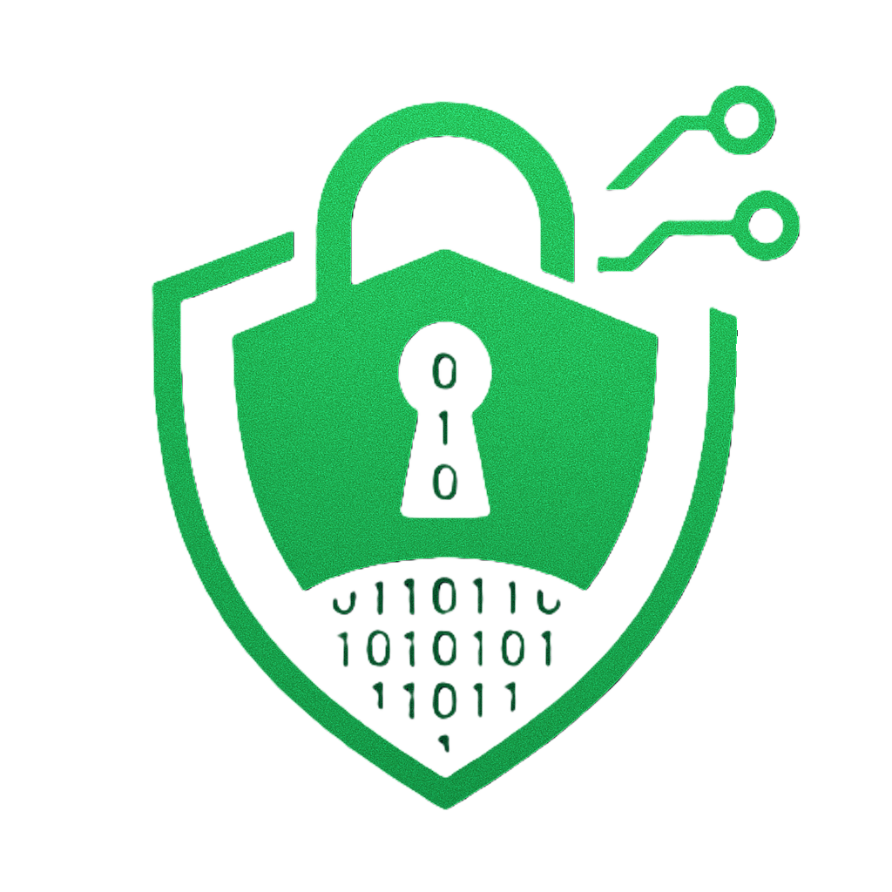

HideNSeek - Secure Steganography Made Simple
<div align="center">  <br> <em>Hide your secrets in plain sight</em> <br><br> </div>


✨ Features
Dual Steganography Support: Hide data in both static images (PNG, JPG) and animated GIFs
Military-Grade Encryption: Secure your embedded data with Fernet symmetric encryption
Intuitive Dark UI: Modern interface with drag-and-drop functionality
Password Protection: Add an extra layer of security with password authentication
Audit Trail: Keep track of all steganography operations with built-in history logging
Cross-Platform: Works seamlessly on Windows, macOS, and Linux
<div align="center">  </div>
🚀 Quick Start
Download Ready-to-Use Application
Skip installation and download the executable for your platform.

Run from Source
Clone the repository

Install dependencies

Launch the application

🛠️ How It Works
HideNSeek employs sophisticated steganography techniques to conceal your data:

Feature	Technology	Benefit
Image Steganography	LSB (Least Significant Bit)	Virtually undetectable changes to images
GIF Steganography	Custom frame encoding	Hide data across animation frames
Encryption	Fernet symmetric encryption	128-bit security for your data
Authentication	SHA-256 hashing	Verify data integrity
📸 Screenshots
<div align="center">   <br>  </div>
🔍 Use Cases
Secure Communication: Exchange sensitive information without raising suspicion
Digital Watermarking: Protect your intellectual property by embedding ownership information
Backup Critical Data: Store important credentials within ordinary-looking media files
Privacy Protection: Keep your personal information hidden from prying eyes

##🧩 Project Structure
```
HideNSeek/
├── assets/              # Screenshots and demo materials
├── src/                 # Source code
│   ├── main.py          # Main application and GUI
│   ├── img.py           # Image steganography engine
│   └── gif.py           # GIF steganography engine
├── history.json         # Operation history storage
├── requirements.txt     # Python dependencies
└── README.md            # Documentation

```
---
⚙️ Technologies
CustomTkinter: For the sleek, modern UI
Pillow & NumPy: Image processing and manipulation
Cryptography: Secure data encryption
TkinterDnD2: Drag-and-drop functionality
PyInstaller: Application packaging
💡 Why Choose HideNSeek?
User-Friendly: No technical expertise required
Secure by Design: Multiple layers of security built in
Free & Open Source: Transparent code you can trust
Actively Maintained: Regular updates and improvements
Lightweight: Minimal system resource usage
🤝 Contributing
Contributions are welcome! Please feel free to submit a Pull Request.

Fork the repository
Create your feature branch (git checkout -b feature/amazing-feature)
Commit your changes (git commit -m 'Add some amazing feature')
Push to the branch (git push origin feature/amazing-feature)
Open a Pull Request
📜 License
This project is licensed under the MIT License - see the LICENSE file for details.

<div align="center"> <p>Made with ❤️ by <a href="https://github.com/your-username">Your Name</a></p> <p>Star ⭐ this repository if you find it useful!</p> </div>